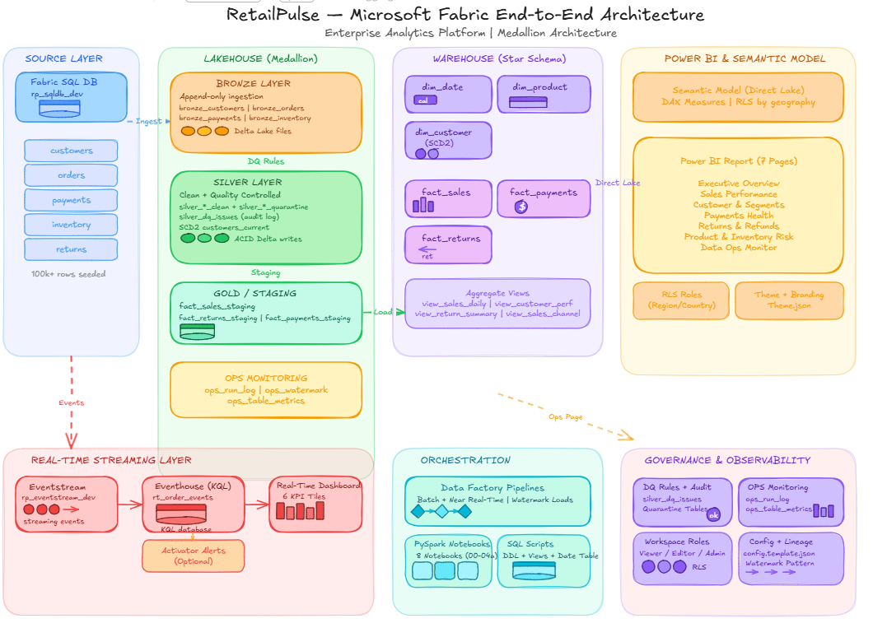

# RetailPulse — Enterprise-Grade Microsoft Fabric Analytics Platform



> **Production-Ready Demo**: A complete end-to-end analytics solution showcasing modern data engineering, governance, and real-time monitoring patterns using Microsoft Fabric.

---

## 🎯 Executive Summary

**RetailPulse** demonstrates a real-world architecture where a retail company operates three synchronized data pipelines:

- **Operational OLTP** (SQL Database) — transactional source of truth
- **Batch + Near Real-Time Analytics** (Lakehouse → Warehouse) — curated insights for leadership
- **Real-Time Monitoring** (Eventstream → Eventhouse → Dashboard) — live ops visibility

This project showcases **enterprise data engineering best practices**:
✅ Modern medallion architecture (Bronze → Silver → Gold)  
✅ Comprehensive data quality monitoring & quarantine  
✅ Star schema for performant, governed BI  
✅ Real-time and batch data fusion  
✅ Observable data pipelines with ops monitoring  
✅ Clear separation of concerns and scalable design patterns

**Why this matters**: Most companies struggle with data silos, inconsistent metrics, and blind spots in production. RetailPulse shows how to solve this.

---

## 📊 What's Demonstrated Here

| Capability | Implementation | Benefit |
|---|---|---|
| **Data Ingestion** | Multi-source (SQL DB → Lakehouse) | Captures all transactional data reliably |
| **Data Quality** | DQ rules, quarantine tables, DQ logging | Trust in data; audit trail for issues |
| **Data Transformation** | PySpark bronze/silver layers | Scalable, documented transformations |
| **Analytics Warehouse** | Star schema (dims + facts) | Fast BI queries, governed metrics |
| **Real-Time Processing** | Eventstream → Eventhouse (KQL) | Sub-minute operational awareness |
| **Observability** | OPS monitoring tables + logs | Know when pipelines fail before users call |
| **Governance** | Workspace roles, semantic model security | Compliance-ready, audit-friendly |

---

## 🏗️ High-Level Architecture

```
┌─────────────────────────────────────────────────────────────┐
│  OPERATIONAL SOURCE                                         │
│  ├─ Fabric SQL Database (rp_sqldb_dev)                     │
│  └─ Tables: customers, orders, payments, inventory, returns│
└──────────────┬──────────────────────────────────────────────┘
               │
    ┌──────────┴──────────┬──────────────────┐
    │                     │                  │
    ▼                     ▼                  ▼
┌─────────┐  ┌──────────────┐  ┌──────────────────────┐
│LAKEHOUSE│  │  EVENTSTREAM │  │  POWER BI (Batch)    │
│(NRT)    │  │  (Real-Time) │  │  (Direct Lake)       │
│         │  │              │  │                      │
│Bronze   │  │ rp_eventstream   Semantic model ◄──────┤
│  ↓      │  │ _dev         │  │ Star schema          │
│Silver   │  │      │       │  │ (Warehouse)          │
│  ↓      │  │      ▼       │  │                      │
│Ops Mon  │  │  Eventhouse  │  └──────────────────────┘
│  ↓      │  │  (KQL DB)    │
│         │  │              │
│ Gold ◄──┼──┤  rt_order_   │
│Warehouse│  │  events      │
│Star     │  │       │      │
│Schema   │  │       ▼      │
└─────────┘  │  Real-Time   │
             │  Dashboard   │
             │              │
             └──────────────┘
```

---

## 📁 Repository Structure

```
├── 00_docs/
│   ├── demo_walkthrough.md          # 5-min demo script
│   ├── architecture.png             # High-level architecture diagram
│   ├── data_model.png               # Warehouse star schema
│   └── report_screenshots/          # Power BI visuals
│
├── 01_sqldb/
│   ├── ddl_create_tables.sql        # OLTP schema (customers, orders, etc.)
│   ├── seed_v2_100k.sql             # Realistic dataset (100k+ rows)
│   └── cleanup_truncate.sql         # Reset script
│
├── 02_lakehouse/
│   ├── notebooks/
│   │   ├── 00_ops_watermark_init         # Init watermark for incremental runs
│   │   ├── 01_load_bronze_from_sql_db    # Ingest OLTP → Bronze (append-only)
│   │   ├── 02_build_silver               # Transform, clean, quarantine bad rows
│   │   ├── 02a_customers_current         # SCD2 logic for customer dimension
│   │   ├── 03_fact_sales_staging         # Fact table staging for warehouse load
│   │   ├── 03b_fact_returns_staging      # Returns fact staging
│   │   ├── 03c_fact_payments_staging     # Payments fact staging
│   │   └── 04a_ops_monitoring            # Write ops logs, metrics, and watermarks
│   ├── dq_rules.md                  # Data quality rules applied in Silver layer
│   └── screenshots/
│       ├── bronze_lakehouse_tables.png
│       ├── silver_lakehouse_tables.png
│       └── gold_staging_&_ops_tables.png
│
├── 03_warehouse/
│   ├── ddl_star_schema.sql          # Create Warehouse tables (dims + facts)
│   ├── date_table.sql               # Conformed date dimension
│   ├── view_sales_daily.sql         # Aggregate views for quick BI access
│   ├── view_customer_performance.sql
│   ├── view_return_summary.sql
│   └── view_sales_channel_summary.sql
│
├── 04_powerbi_&_semantic_model/
│   ├── mesures_dax.md               # DAX measures (SARIMAX, YTD, etc.)
│   ├── powerbi_report.pbix          # Report file with semantic model
│   ├── report_export.pdf            # PDF export of key pages
│   ├── data_model.png               # Semantic model visual
│   └── Theme.json                   # Report theme/branding
│
├── 05_pipelines/
│   ├── rp_orchestrator_dev_steps.md # Data Factory pipeline orchestration
│   ├── batch_pipeline_design.png
│   └── near_realtime_pipeline_design.png
│
├── 06_ops_governance/
│   ├── data_quality_log_schema.md   # DQ issue tracking schema
│   ├── monitoring_metrics.md        # Observable metrics to track
│   └── rls_plan.md                  # Row-level security design
│
├── 07_realtime_streaming/
│   ├── eventstream_setup.md         # Eventstream configuration
│   ├── eventhouse_tables_kql.kql    # KQL table schema and queries
│   ├── event_schema.md              # Real-time event payload spec
│   ├── activator_rules.md           # Alert automation (optional)
│   ├── realtime_dashboard_tiles.md  # Dashboard tile definitions
│   └── screenshots/
│       ├── eventstream_canvas.png
│       ├── eventhouse_table_rt_order_events.png
│       ├── realtime_dashboard.png
│       └── activator_rule.png
│
└── config.template.json             # Environment configuration template
```

---

## 🚀 Quick Start (5 Steps)

### Step 1: Create Fabric SQL Database
```
Fabric → New → SQL Database
Name: rp_sqldb_dev
```
Then execute:
- [ddl_create_tables.sql](01_sqldb/ddl_create_tables.sql) — create schema
- [seed_v2_100k.sql](01_sqldb/seed_v2_100k.sql) — load test data

### Step 2: Create Lakehouse & Run Bronze Load
```
Create Lakehouse: rp_lakehouse_dev
```
Run notebooks in order:
1. [00_ops_watermark_init](02_lakehouse/notebooks/00_ops_watermark_init.ipynb)
2. [01_load_bronze_from_sql_db](02_lakehouse/notebooks/01_load_bronze_from_sql_db.ipynb)

### Step 3: Build Silver (Clean & Quality Check)
Run:
3. [02_build_silver](02_lakehouse/notebooks/02_build_silver.ipynb)
4. [02a_customers_current](02_lakehouse/notebooks/02a_customers_current.ipynb)

### Step 4: Create Warehouse & Load Facts
```
Create Warehouse: rp_warehouse_dev
```
Execute SQL scripts:
- [ddl_star_schema.sql](03_warehouse/ddl_star_schema.sql)
- [date_table.sql](03_warehouse/date_table.sql)

Then run staging notebooks:
5. [03_fact_sales_staging](02_lakehouse/notebooks/03_fact_sales_staging.ipynb)
6. [03b_fact_returns_staging](02_lakehouse/notebooks/03b_fact_returns_staging.ipynb)
7. [03c_fact_payments_staging](02_lakehouse/notebooks/03c_fact_payments_staging.ipynb)

### Step 5: Setup Real-Time (Optional)
See [07_realtime_streaming/eventstream_setup.md](07_realtime_streaming/eventstream_setup.md)

---

## 📊 Data Model (Warehouse Star Schema)

### Dimensions
| Table | Purpose | Key Attributes |
|---|---|---|
| **dim_date** | Conformed date dimension | Date, Month, Quarter, Year, IsWeekend, DayOfWeek |
| **dim_product** | Product master (from inventory) | ProductID, Name, Category, Price, Active |
| **dim_customer** | Customer dimension (SCD2) | CustomerID, Name, Segment, Country, ActiveFlag, EffectiveDate |

### Facts
| Table | Grain | Key Metrics |
|---|---|---|
| **fact_sales** | Order line item level | Qty, Amount, DiscountPct, Revenue |
| **fact_payments** | Payment transaction | Amount, Status, PaymentMethod, ProcessingTime |
| **fact_returns** | Return line item | Qty, Amount, ReturnReason, RestockFlag |

See [data_model.png](00_docs/data_model.png) for visual ERD.

---

## 🎨 Power BI Report (7 Pages)

The semantic model includes **15+ DAX measures** and supports these personas:

| Page | Audience | Key Insights |
|---|---|---|
| **Executive Overview** | C-Suite | Revenue, AOV, Top Products, Geographic Mix |
| **Sales Performance** | Sales Lead | Daily/Weekly/Monthly trends, Forecast vs. Actual |
| **Customer & Segments** | Marketing | Repeat customer %, Segment spend, Churn proxy |
| **Payments Health** | Finance/Ops | Success rate, Failure reasons, Provider performance |
| **Returns & Refunds** | Product/Ops | Return rate by product, Reason breakdown, Cost impact |
| **Product & Inventory Risk** | Inventory | Low-stock alerts, High-return products, Seasonal trends |
| **Data Ops Monitor** | Data Eng | Pipeline freshness, DQ issues, Row count trends |

### Executive Overview

High-level KPIs, revenue trends, and geographic distribution for leadership decision-making.

### Customer & Segment Insights

Segment performance, repeat customer analysis, and cohort insights for marketing and strategy teams.

### Payments & Returns Health

Payment success rates, failure reasons, returns by product, and refund analysis for operations and finance.

All measures documented in [04_powerbi_&_semantic_model/mesures_dax.md](04_powerbi_&_semantic_model/mesures_dax.md).

---

## ⚡ Real-Time Dashboard


**6 KPI Tiles** (auto-refreshing):
- Order Count (Last 1 Hour)
- Total Revenue (Last 1 Hour)
- Avg Order Value
- Payment Success Rate
- Returns Count
- Inventory Alerts

**Trends & Breakdowns**:
- Orders by Channel (line chart)
- Revenue by Country (map or bar)
- Top Sellers (table)
- Payment Methods (pie)

KQL queries in [07_realtime_streaming/realtime_dashboard_tiles.md](07_realtime_streaming/realtime_dashboard_tiles.md).

---

## 🔍 Data Quality & Monitoring

### Bronze → Silver Transformation
```
Bronze (Raw)
  ├─ bronze_customers
  ├─ bronze_orders
  └─ bronze_payments
       ↓
   [PySpark Transformations]
   • Null/duplicate checks
   • Type validation
   • Business rule validation
       ↓
Silver (Clean)
  ├─ silver_customers_clean
  ├─ silver_orders_clean
  ├─ silver_payments_clean
  ├─ silver_*_quarantine (bad rows)
  └─ silver_dq_issues (audit log)
```

### DQ Rules (Applied in [02_build_silver](02_lakehouse/notebooks/02_build_silver.ipynb))
See [02_lakehouse/dq_rules.md](02_lakehouse/dq_rules.md) for complete list:
- ✅ No null primary keys
- ✅ Dates within valid range
- ✅ Duplicate detection by natural key
- ✅ Referential integrity (order → customer, etc.)
- ✅ Negative amount detection
- ✅ Outlier flagging (qty > 1000, etc.)

All violations logged to `silver_dq_issues` for investigation.

### Operational Monitoring
Notebook [04a_ops_monitoring](02_lakehouse/notebooks/04a_ops_monitoring.ipynb) writes:

**ops_run_log**
```
run_id, notebook, start_time, end_time, status, row_count, errors
```

**ops_table_metrics**
```
table_name, row_count, null_count, duplicate_count, last_updated
```

**ops_watermark**
```
table_name, last_watermark_ts (for incremental loads)
```

These tables power the "Data Ops Monitor" page in Power BI for **observability**.

---

## 🛠️ Tech Stack

| Layer | Technology | Why |
|---|---|---|
| **Operational DB** | Fabric SQL Database | ACID-compliant transactional source |
| **Data Lake** | Lakehouse (Delta Lake) | Unified storage + ACID writes + versioning |
| **Transformation** | PySpark (Python) | Scalable, familiar, Fabric-native |
| **Warehouse** | Fabric Warehouse (SQL) | Optimized for analytics queries |
| **Real-Time** | Eventstream + Eventhouse (KQL) | Sub-minute ingestion + KQL query engine |
| **BI** | Power BI (Direct Lake) | Fast, governed, enterprise-standard |
| **Orchestration** | Fabric Data Factory Pipelines | Managed dependencies, retry logic |

---

## 📈 Key Features Highlighted

### ✅ Modern Medallion Architecture
- **Bronze**: Append-only ingestion, full history captured
- **Silver**: Cleaned, deduplicated, quality-controlled
- **Gold**: Curated warehouse, optimized for BI

### ✅ Observability & Governance
- Data quality quarantine + audit logs
- Pipeline run logs + metrics
- Clear ownership and lineage

### ✅ Scalable Design
- Incremental loading (watermark pattern)
- Near real-time + batch coordination
- Separation of concerns (staging → warehouse)

### ✅ Production Ready
- Error handling in notebooks
- Idempotent transforms (safe to re-run)
- Documentation at every layer

---

## 🎓 Why This Matters for Your Org

| Challenge | How RetailPulse Solves It |
|---|---|
| "We don't know if our data is accurate" | DQ rules + quarantine + audit logs show exactly what's wrong |
| "Dashboards are slow" | Star schema + warehouse design = fast, cached queries |
| "We can't respond to incidents in real time" | Eventstream + real-time dashboard = live visibility |
| "Data pipelines fail silently" | OPS monitoring tables + Power BI ops page = early detection |
| "Teams use different definitions" | Governed semantic model = single source of truth |
| "We can't scale beyond our current tools" | Lakehouse + warehouse is designed for 100M+ rows |

---

## 📋 Implementation Checklist

- [x] Operational OLTP seeded with realistic 100k+ row dataset
- [x] Bronze layer ingesting all sources incrementally
- [x] Silver layer with DQ quarantine + 8+ DQ rules
- [x] OPS monitoring tables (freshness, duplicates, run logs)
- [x] Warehouse star schema (3 dims + 3 facts)
- [x] Power BI semantic model with 15+ DAX measures
- [x] Real-time dashboard with KQL queries
- [x] Documentation at each layer
- [ ] (Optional) Activator alerts → Teams/Power Automate
- [ ] (Optional) RLS by country/region
- [ ] (Optional) Return risk prediction model

---


## 🔐 Governance & Security Patterns

- **Workspace Roles**: Viewer / Editor / Admin role-based access
- **Semantic Model RLS**: (Optional) Filter by country, region, or sales org
- **Audit Trail**: All DQ issues, pipeline runs logged to OPS tables
- **Documentation**: Every table has a business definition + owner

See [06_ops_governance/rls_plan.md](06_ops_governance/rls_plan.md) for full security design.

---

## 📚 Documentation

| Document | Purpose |
|---|---|
| [demo_walkthrough.md](00_docs/demo_walkthrough.md) | Live demo script + timing |
| [dq_rules.md](02_lakehouse/dq_rules.md) | Data quality rules applied |
| [mesures_dax.md](04_powerbi_&_semantic_model/mesures_dax.md) | All DAX formulas explained |
| [eventstream_setup.md](07_realtime_streaming/eventstream_setup.md) | Real-time pipeline config |
| [eventhouse_tables_kql.kql](07_realtime_streaming/eventhouse_tables_kql.kql) | KQL table schema |
| [rls_plan.md](06_ops_governance/rls_plan.md) | Security role design |

---

## 🚀 Roadmap (Future Enhancements)

- **Micro-Batch KPI Table**: Real-time KPIs updated every 5–15 minutes
- **Activator Alerts**: Automated Teams/Power Automate notifications
- **RLS by Geography**: Restrict dashboards by country for regional teams
- **Predictive Models**: Return risk, payment failure forecasting
- **CI/CD Integration**: Git-based deployment (Dev → Test → Prod)

---


## 📞 Contact

**Srinivas K** — Microsoft Fabric + Data Engineering + Power BI  
Portfolio Project: End-to-end retail analytics on Fabric  

---

## 📄 License

This project is provided as-is for educational and portfolio purposes.  
See [LICENSE](LICENSE) for details.

---

## 🤝 Feedback & Contributions

Found an issue? Have ideas for improvement? **Open an issue** or **submit a PR**.

---

**Last Updated**: February 2026  
**Status**: Production-Ready Demo ✅
